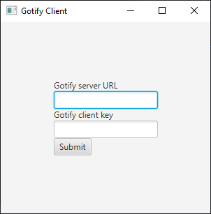

# Gotify Client for Windows
Disclaimer: this app might run on systems other than Windows and was tested only on Windows 10.

## Table of contents
1. [Building](#building)
2. [Using](#using)

## Building

Java 11 is required to build and run this app.  
Run ``./gradlew shadowJar`` after cloning this repo in terminal. The jar will be out in build/libs directory.

## Using

Run ``java -jar <jar name>.jar`` to start the app.  
If there's no config.properties file in the directory, you'll see something like this: 

  

This is a first time setup. URL must include http:// or https://  
After completing first time setup, the app will try to connect to Gotify server. If it's not able to do that, you'll see a proper notification.  

## Adding to autostart 

You can put the jar and config.properties anywhere and then make a shortcut for the jar file and copy it to the autostart directory:  ``C:\Users\<Username>\AppData\Roaming\Microsoft\Windows\Start Menu\Programs\Startup``  
